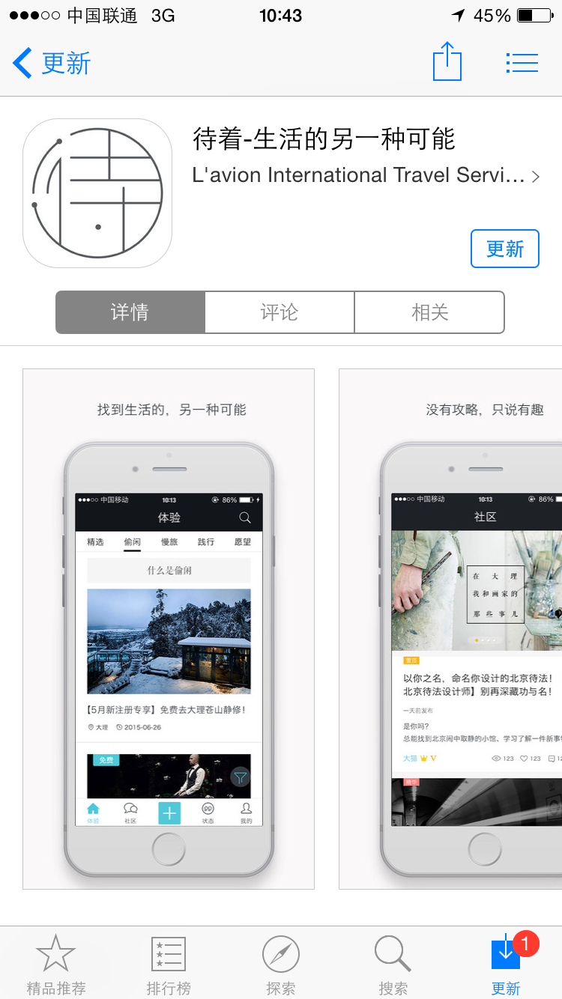
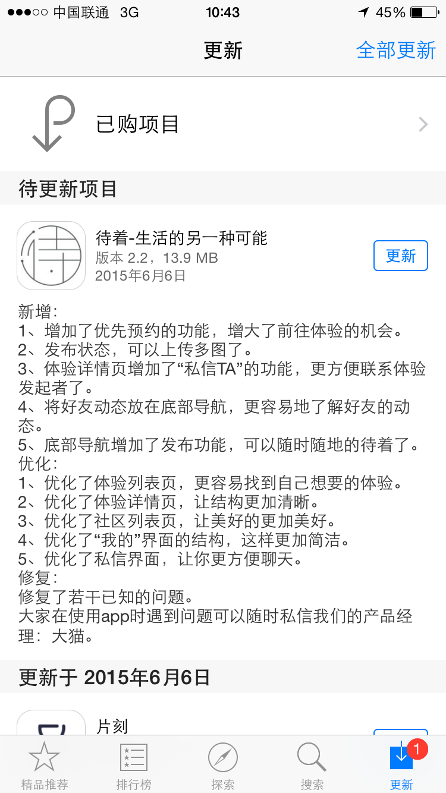

# 

待着是一个兴趣社区，为你提供遍布全球的精彩人生体验，但需要你是平凡生活里不甘平庸的异类。

Slogan —— 待着，只有少数人才懂。待着，生活的另一种可能。

|||
|----|-----|

- 开发语言： OC
- 开源库：AFN，SDWebImage，MJRefresh，MBProgressHUD，MJExtension
- 第三方库：微信/支付宝支付，QQ/微信/微博/豆瓣第三方登录，百度地图，友盟统计
- 其他：纯代码，自定义Tabbar，自定义UI，工具类，分类，block，delegate，通知

